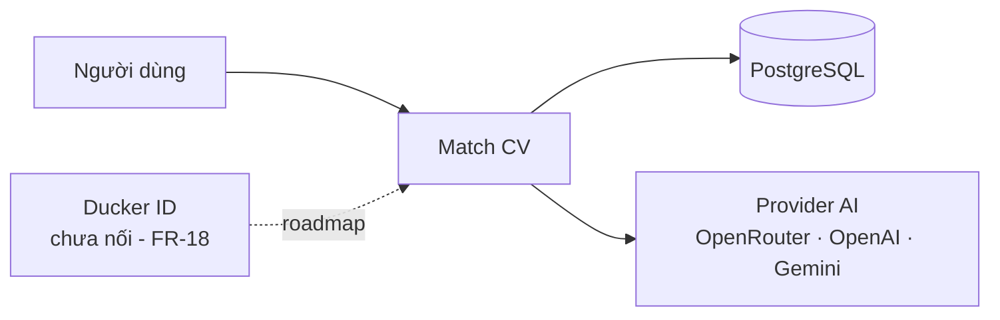
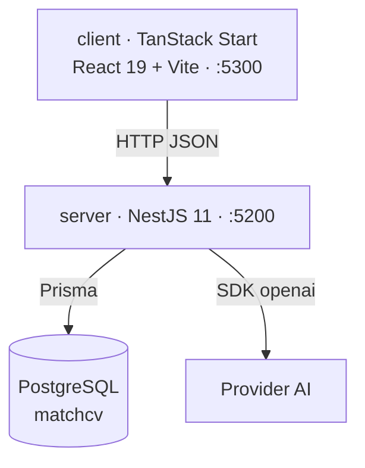

# Kiến trúc

> **Trả lời:** Hệ thống ghép lại thế nào, ranh giới giữa các phần ở đâu?
> **Trạng thái:** 🟢 đủ
> **Cập nhật:** 2026-09-03 · commit —
> **Cập nhật khi:** thêm/bỏ một module hoặc service · đổi cách hai module nói chuyện

<!-- CÁCH ĐIỀN
Mức độ: C4 mức 1 (context) và mức 2 (container). KHÔNG đi xuống class hay function.
Mục 5 chỉ ghi TÊN công nghệ + số ADR. LÝ DO chọn nằm trong ADR, không nằm đây.
KHÔNG chứa: lý do chọn công nghệ (-> decisions/), bất biến (-> invariants.md),
schema chi tiết (-> erd.md), danh sách chức năng (-> 02-requirements/scope.md).
-->

## 1. Context — hệ thống nằm giữa ai với ai

Chỉ có **một** hệ thống ngoài đang thật sự được gọi: provider AI, qua SDK `openai`,
phân biệt nhau bằng `baseURL` + tên model. Ducker ID là roadmap, chưa có đường nào
trong code chạm tới nó.

## 2. Container — hệ thống gồm những khối chạy được nào

Không có worker, không có hàng đợi, không có cache. Match chạy **đồng bộ** trong
request (NFR-PERF-06). Không dùng Docker — PostgreSQL chạy local.

⚠️ Client bind `:5300`, trùng cổng server của Shorten Link trong cùng workspace.

## 3. Module và ranh giới

### server (`server/src/modules/`)

| Module | Trách nhiệm một câu | Được phép gọi | **Không** được gọi |
| --- | --- | --- | --- |
| `health` | Báo app còn sống | — | — |
| `documents` | CRUD tài liệu, parse PDF/DOCX/text, stream file gốc, khai lineage `parentId` | `prisma` | `ai` |
| `matching` | Chấm hybrid, sở hữu `tokenizer.ts` — **định nghĩa token duy nhất của hệ thống** | `prisma`, `ai`, `documents` | — |
| `ai` | Dựng client provider **per-request**, gọi chat + embed | `ai-credentials` | `prisma` trực tiếp cho nghiệp vụ khác |
| `ai-credentials` | CRUD khoá AI, mã hoá/giải mã AES-256-GCM, test connection | `prisma` | — |
| `cv-rewrite` | Sinh thay đổi có neo, kiểm neo, lưu thành `Document` mới | `prisma`, `ai`, `matching` | — |
| `cover-letters` | Sinh / sửa / xoá thư ứng tuyển | `prisma`, `ai` | — |
| `comparison` | So hai phiên bản CV trên một JD, ghép gap bằng `gap-diff.ts` | `prisma`, `matching` (chỉ tokenizer) | **`ai`** — xem invariant #19 |
| `me` | Export toàn bộ dữ liệu của user | `prisma` | `ai` |
| `common/current-user` | Nguồn duy nhất của `userId` (hiện là mock user) | — | — |
| `prisma` · `config` · `i18n` | Hạ tầng | — | — |

Hạ tầng dùng chung: Swagger, helmet, `ThrottlerGuard` (100 req/60s), `nestjs-i18n`.

### client (`client/src/`) — layer-first, không feature-first

| Lớp | Trách nhiệm | Được phép gọi |
| --- | --- | --- |
| `routes/_app/*` | Khai báo route, không chứa logic | `views` |
| `layouts/AppShell` | Vỏ app: sidebar, nav | `components` |
| `views/<Màn>` | Một màn hình, chia `mains/` + hook riêng | `requests`, `stores`, `components`, `hooks` |
| `requests/` | Gọi API, nơi **duy nhất** biết đường dẫn endpoint | `libs` |
| `stores/` · `types/` · `constants/` · `locales/` | State, kiểu, hằng, chuỗi i18n | — |

## 4. Luồng dữ liệu của đường đi quan trọng nhất

Một lần chấm (US-01), khi user chọn N provider:

1. `POST /match` nhận `{ cvDocumentId, jdDocumentId, credentialIds[] }` — **không nhận
   nội dung tài liệu**, chỉ nhận id; nội dung lấy từ DB, đã cô lập theo user.
2. `matching` đọc `rawText` hai tài liệu, tách token bằng `tokenizer.ts`, tính
   `keywordScore` tại chỗ.
3. Với **mỗi** provider: `ai` dựng client per-request từ credential đã giải mã → 2 call
   embed (CV, JD) → cosine tại chỗ ra `semanticScore` → 1 call chat ra `report`.
4. `overallScore` tính theo công thức cố định (invariant #7). Một `MatchRun` gom N
   `MatchResult`; provider hỏng thì row đó `status=failed` + `errorCode`, **vẫn 201**.
5. Client bắn N request song song, render dần: xong trước hiện trước.

Semantic **không đi qua pgvector** — chỉ có 2 vector mỗi lần chấm nên cosine tính
trong app ([ADR-0017](../decisions/0017-semantic-khong-pgvector-o-mvp.md)).

## 5. Tech stack

**Version là `package.json`, không phải bảng này.** Bảng chỉ ghi *cái gì* và *vì sao*;
con số version chép tay là nguồn thứ hai và nó sẽ lệch.

### server

| Lớp | Công nghệ | Biện minh |
| --- | --- | --- |
| Runtime · ngôn ngữ | Node.js LTS + TypeScript | — |
| Framework | NestJS 11 (Express platform) | [ADR-0002](../decisions/0002-be-nestjs-postgres-prisma.md) |
| ORM | Prisma, **pin 6.x** | [ADR-0002](../decisions/0002-be-nestjs-postgres-prisma.md) · [ADR-0020](../decisions/0020-pin-prisma-6.md) |
| Datastore | PostgreSQL local, không Docker; pgvector hoãn | [ADR-0002](../decisions/0002-be-nestjs-postgres-prisma.md) · [ADR-0017](../decisions/0017-semantic-khong-pgvector-o-mvp.md) |
| AI | SDK `openai` → OpenRouter / OpenAI / Gemini | [ADR-0005](../decisions/0005-ai-qua-openrouter-sdk-openai.md) · [ADR-0010](../decisions/0010-provider-whitelist-chat-va-embed.md) |
| Mã hoá secret | `node:crypto` AES-256-GCM — **không thêm dependency** | [ADR-0009](../decisions/0009-byo-token-luu-server-ma-hoa.md) |
| Validation | `class-validator` + `class-transformer` (DTO) | — |
| API docs | `@nestjs/swagger` | — |
| Bảo mật | `helmet` · `cors` · `@nestjs/throttler` | NFR-SEC-07 |
| i18n | `nestjs-i18n` — `en` + `vi` | NFR-I18N-01 |
| Parse file | `pdf-parse` (PDF) + `mammoth` (DOCX) | — |
| Test | Jest. `test:e2e` cần `cross-env NODE_OPTIONS=--experimental-vm-modules` vì `pdf-parse`/pdfjs dùng dynamic import | — |

### client

| Lớp | Công nghệ | Biện minh |
| --- | --- | --- |
| Framework | TanStack Start (React 19 trên Vite, SSR + server function) | [ADR-0003](../decisions/0003-fe-tanstack-start-antd-tailwind.md) |
| UI lib · styling | Ant Design + Tailwind v4 | [ADR-0003](../decisions/0003-fe-tanstack-start-antd-tailwind.md) |
| Server state | TanStack Query | — |
| Client state | Zustand — state 4 bước wizard, slice `ui` cho sidebar | — |
| Form | `react-hook-form` + `zod` | — |
| i18n | `i18next` / `react-i18next` — `en` + `vi` | NFR-I18N-01 |
| Xem trước tài liệu | `react-pdf` + `docx-preview` — render **client-side**, không qua dịch vụ ngoài vì PII | [ADR-0019](../decisions/0019-preview-tai-lieu-chay-client-side.md) |
| Test | Vitest (unit, chạy serial) + Playwright (E2E) | — |

Chưa dùng: hàng đợi nền (BullMQ + Redis là roadmap của FR-19), email.

Schema chi tiết: [`../erd.md`](../erd.md). Token UI:
[`../design-system/match-cv/MASTER.md`](../design-system/match-cv/MASTER.md).
